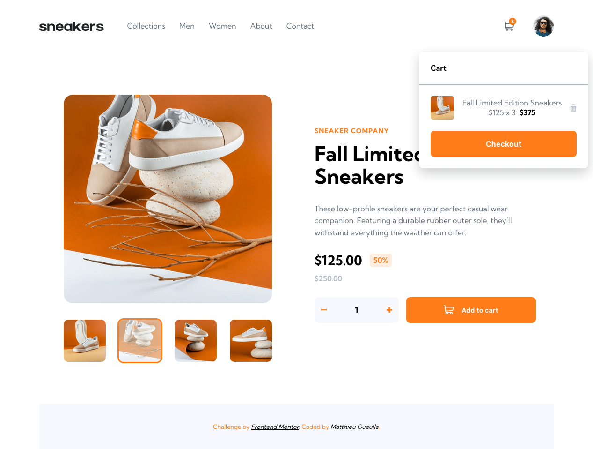
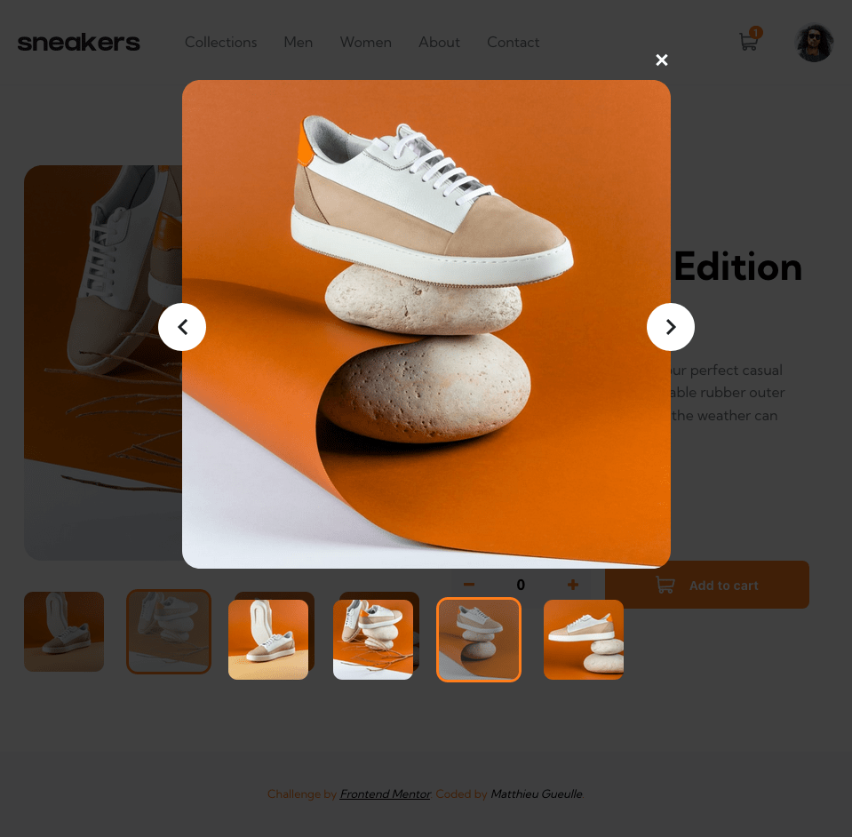

# SNEAKERS E-commerce product page solution

Voici ma proposition au challenge [E-commerce product page de Frontend Mentor](https://www.frontendmentor.io/challenges/ecommerce-product-page-UPsZ9MJp6)

## Sommaire

-   [Overview](#overview)
    -   [The challenge](#the-challenge)
    -   [Screenshot](#screenshots)
    -   [Link](#link)
-   [My process](#my-process)

    -   [Built with](#built-with)
    -   [What I learned](#what-i-learned)

    -   [Useful resources](#useful-resources)

-   [Author](#author)
-   [Acknowledgments](#acknowledgments)

## Overview

### The challenge

L'utilisateur doit pouvoir :

-   Consulter la page de manière optimale, quelque soit le device utilisé
-   Observer des animations au survol de tous les éléments intéractifs de la page
-   Ouvrir une galerie d'image (lightbox) en cliquant sur la grande image produit
-   Changer la grande image en cliquant sur l'une des vignettes
-   Ajouter des produits au panier
-   Visualiser le panier dans la page et pouvoir retirer des produits de celui-ci

### Screenshots

Aperçu de la page

Aperçu de la lightbox

### Link

[Le site](https://Matt1208Dev.github.io/sneakers-product-page-react)

## My process

### Built with

-   CSS Vanilla
-   Flexbox
-   Responsive Layout
-   Librairies JS
    -   [React](https://reactjs.org/)
    -   [Redux-Toolkit](https://redux-toolkit.js.org/)
    -   [React Redux](https://react-redux.js.org/)
    -   [UUID](https://github.com/uuidjs/uuid#readme)

### What i learned

-   Coder un Slider en tant que composant React
-   Utilisation de Flexbox
-   Travail du comportement responsif des élements
-   Mise en place du panier d'achats avec Redux pour la gestion des données

### Useful resources

-   [MDN](https://developer.mozilla.org/fr/) - Ma ressource première pour HTML, CSS et JavaScript
-   [Formation React](https://www.udemy.com/course/react-formation-complete/) par [Enzo Ustariz](https://www.youtube.com/@EcoleduWeb).
-   [Introduction à Redux Toolkit](https://youtu.be/1lvnT2oE0_4) par [Lior Chamla](https://www.youtube.com/@LiorCHAMLA)

## Author

-   [Matthieu Gueulle](www.linkedin.com/in/matthieu-gueulle) - LinkedIn

## Acknowledgements

Merci à [Frontend Mentor](https://www.frontendmentor.io/) de mettre à la disposition de tous des projets gratuits et de qualité.
